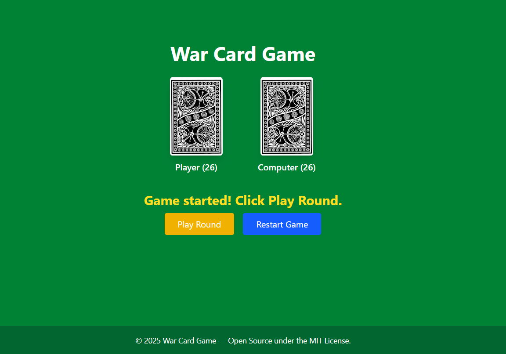
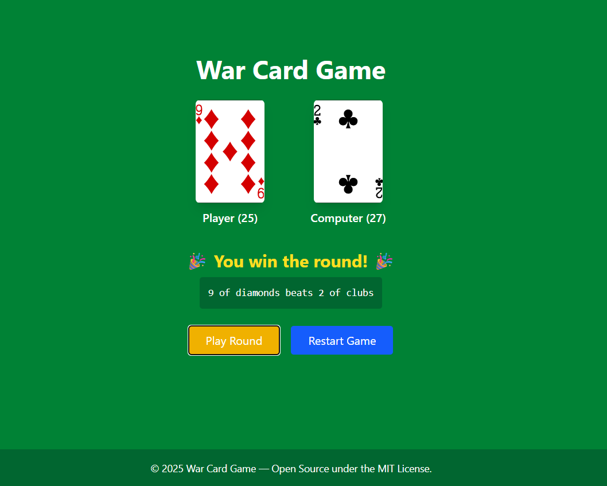
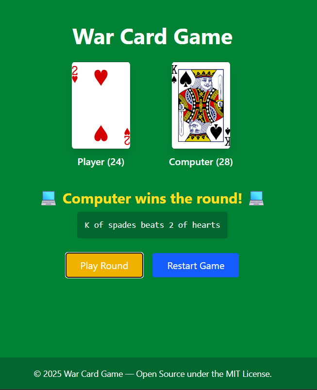
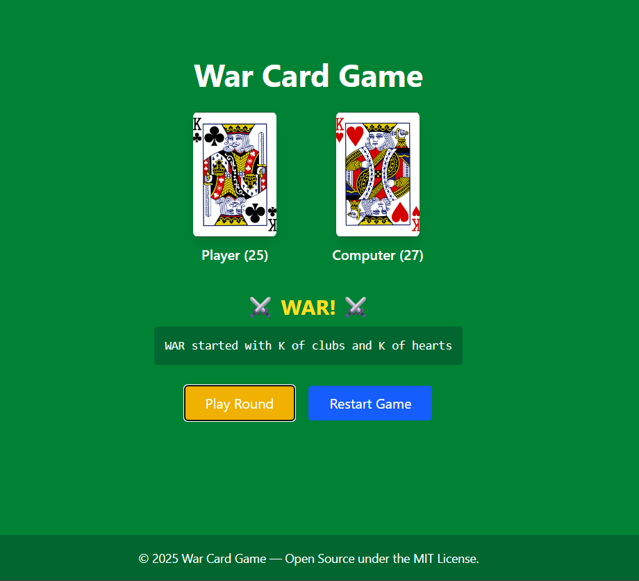
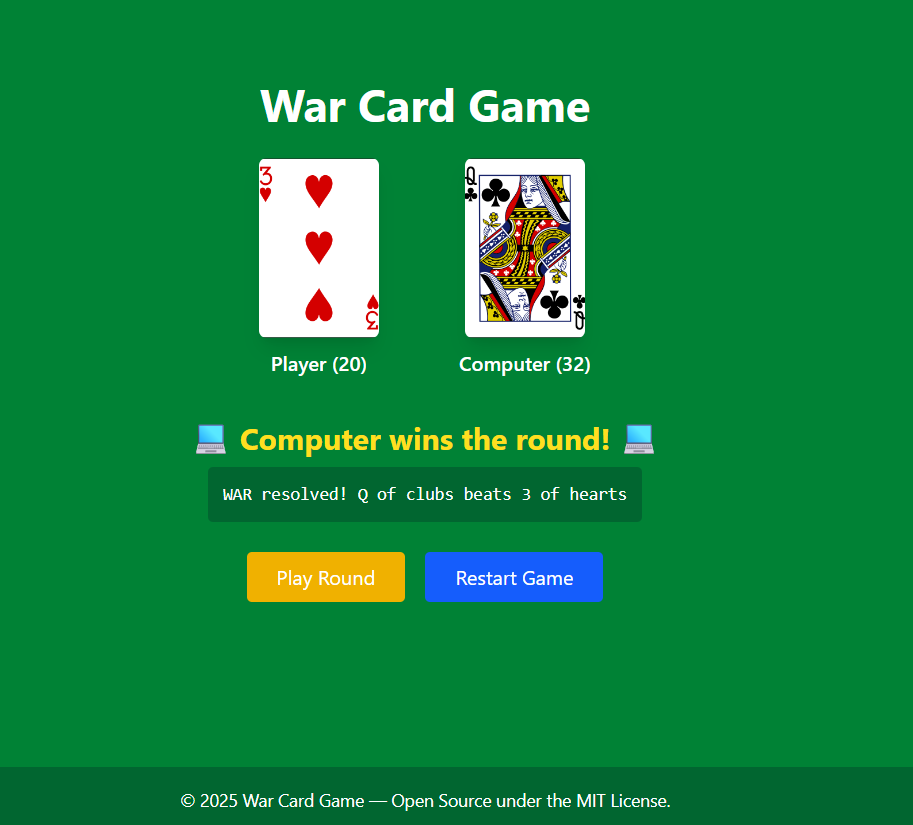
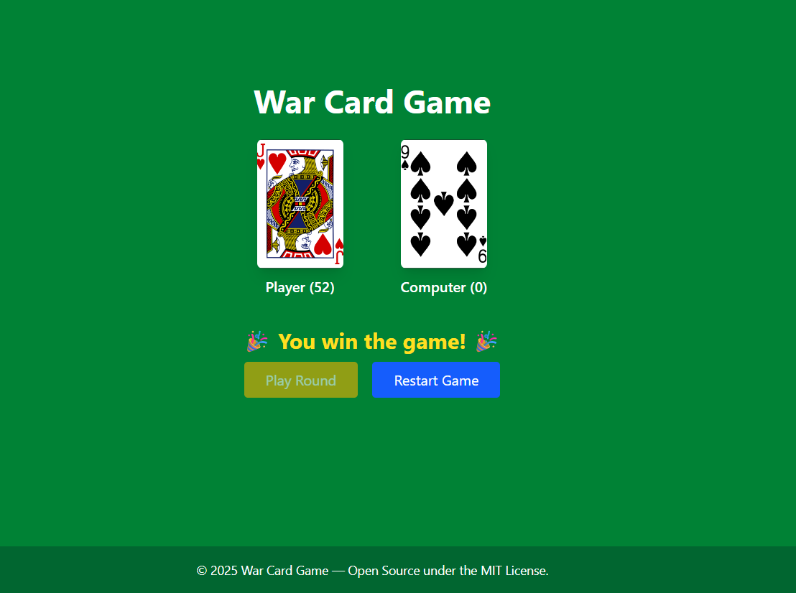

# War Card Game 🃏

A classic two-player card game implemented in React and Tailwind CSS where the player competes against the computer in a battle of luck and strategy. The game features standard War rules, including handling "wars" when players tie cards, with dynamic card visuals and round-by-round feedback.

---

## 🔧 Features

- **⚡ Interactive Gameplay**
  - Turn-based rounds where player and computer draw cards simultaneously
  - Handles "WAR" scenarios when cards tie, with multi-card draws
  - Displays real-time round outcome messages and logs

- **🃏 Card Visuals**
  - Cards displayed with images fetched from Deck of Cards API
  - Shows card backs when no card is played
  - Smooth UI with hover animations for cards

- **🎯 Game Rules**
  - Standard War card game rules implemented
  - Player or computer wins the round based on higher card value
  - War piles accumulate cards during ties and are won by next higher card

- **📊 Score and Progress Tracking**
  - Displays remaining cards count for both player and computer
  - Declares winner or draw when one deck is depleted or all cards won

- **🔄 Restart and Replay**
  - Easily restart the game at any time with a button
  - Clear messaging to guide players throughout the game

---

## 📂 Directory Structure

```
├── src/                         // Main source code
│   ├── components/              // React components
│   │   └── Card.jsx             // Card display component
│   ├── App.jsx                   // Main app component
│   ├── main.jsx                  // Entry point
│   └── ...
├── public/                       // Public assets
│   ├── screenshots/                // Game screenshots
│   └── card-back.png
├── package.json
└── README.md
```

---

## 🛠️ Run Locally

### 1. Install dependencies
```bash
npm install
```

### 2. Start development server
```bash
npm run dev
```

### 3. Open the browser
http://localhost:5173/

---

## 💻 Screenshots

### Game Load



### Game Rounds




### War




### Winner



---

## 📄 License

This project is licensed under the [MIT License](https://opensource.org/licenses/MIT).